# 推+拉打造 Nacos 配置信息的实时更新

上篇文章我和大家分析了 Nacos 的配置中心原理，主要分析了 Nacos 客户端是如何感知到服务端的配置变更的，但是只是从客户端的角度进行了分析，并没有从服务端的角度进行分析，本篇文章我将结合服务端的角度来分析配置变更是如何通知到客户端的。

**PS：文章有点长，因为涉及到多个细节需要阐述，如果看不下去的话，可以直接转到文末看总结即可。**

## 一、客户端

从上篇文章中我们已经知道了 Nacos 的客户端维护了一个长轮询的任务，去检查服务端的配置信息是否发生变更，如果发生了变更，那么客户端会拿到变更的 groupKey 再根据 groupKey 去获取配置项的最新值即可。

每次都靠客户端去发请求，询问服务端我所关注的配置项有没有发生变更，那请求的间隔改设置为多少才合适呢？

如果间隔时间设置的太长的话有可能无法及时获取服务端的变更，如果间隔时间设置的太短的话，那么频繁的请求对于服务端来说无疑也是一种负担。

**所以最好的方式是客户端每隔一段长度适中的时间去服务端请求，而在这期间如果配置发生变更，服务端能够主动将变更后的结果推送给客户端，这样既能保证客户端能够实时感知到配置的变化，也降低了服务端的压力。**

### 客户端长轮询

现在让我们再次回到客户端长轮询的部分，也就是 LongPollingRunnable 中的 checkUpdateDataIds 方法，该方法就是用来访问服务端的配置是否发生变更的，该方法最终会调用如下图所示的方法：

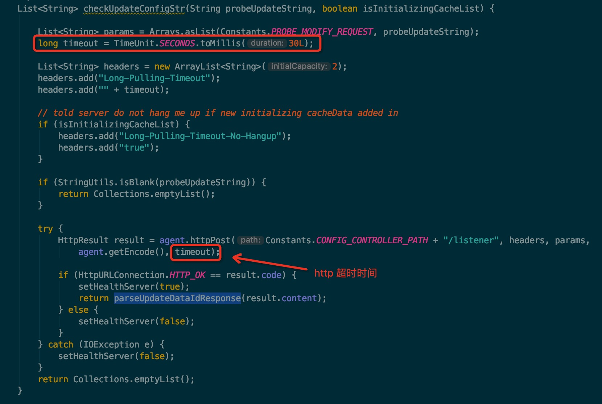

请注意图中红框部分的内容，客户端是通过一个 http 的 post 请求去获取服务端的结果的，并且设置了一个超时时间：30s。

这个信息很关键，为什么客户端要等待 30s 才超时呢？不应该越快得到结果越好吗，我们来验证下该方法是不是真的等待了 30s。

在 LongPollingRunnable 中的 checkUpdateDataIds 方法前后加上时间计算，然后将所消耗的时间打印出来，如下图所示：

然后我们启动客户端，观察打印的日志，如下图所示：

从打印出来的日志可以看出来，客户端足足等了29.5+s，才请求到服务端的结果。然后客户端得到服务端的结果之后，再做一些后续的操作，全部都执行完毕之后，在 finally 中又重新调用了自身，也就是说这个过程是一直循环下去的。

### 长轮询时修改配置

现在我们可以确定的是，客户端向服务端发起一次请求，最少要29.5s才能得到结果，当然啦，这是在配置没有发生变化的情况下。

如果客户端在长轮询时配置发生变更的话，该请求需要多长时间才会返回呢，我们继续做一个实验，在客户端长轮询时修改配置，结果如下图所示：

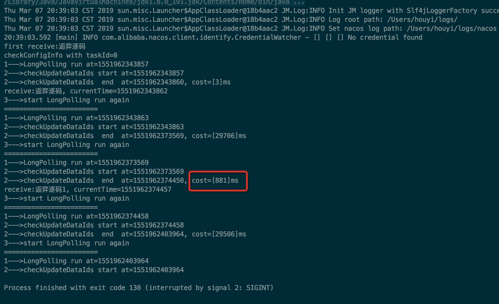

上图中红框中就是我在客户端一发起请求时就更新配置后打印的结果，从结果可以看出来该请求并没有等到 29.5s+ 才返回，而是一个很短的时间就返回了，具体多久需要从服务端的实现中查询答案。

到目前为止我们已经知道了客户端执行长轮询的逻辑，以及每次请求的响应时间会随着服务端配置是否变更而发生变化，具体可以用下图描述：

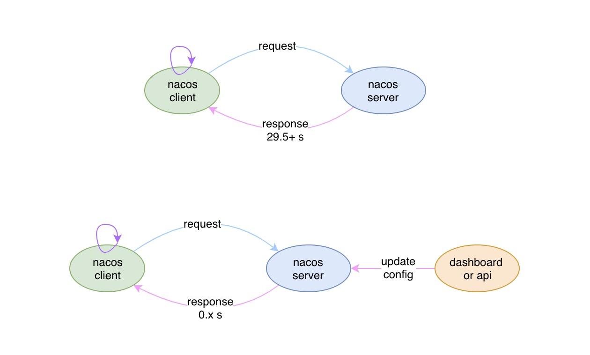

## 二、服务端

分析完客户端的情况，接下来要重点分析服务端是如何实现的，并且要带着几个问题去寻找答案：

- 客户端长轮询的响应时间会受什么影响
- 为什么更改了配置信息后客户端会立即得到响应
- 客户端的超时时间为什么要设置为30s

带着以上这些问题我们从服务端的代码中去探寻结论。

首先我们从客户端发送的 http 请求中可以知道，请求的是服务端的 /v1/cs/configs/listener 这个接口。

我们找到该接口对应的方法，在 ConfigController 类中，如下图所示：

> com.alibaba.nacos.config.server.controller.ConfigController.java

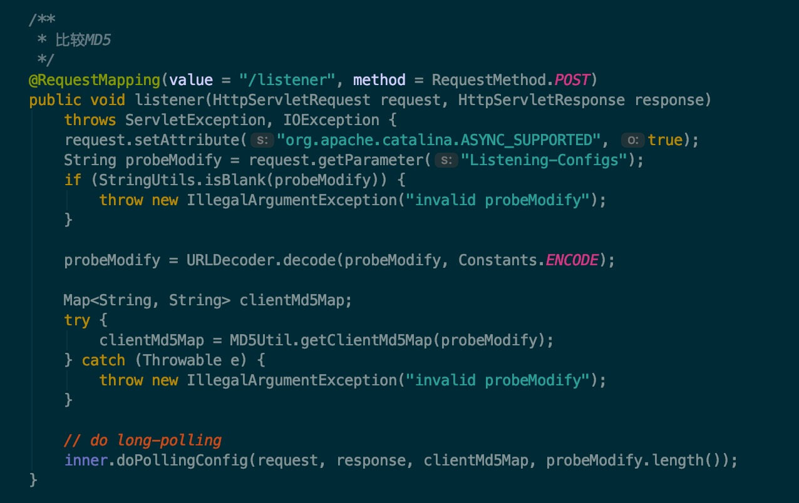

Nacos 的服务端是通过 spring 对外提供的 http 服务，对 HttpServletRequest 中的参数进行转换后，然后交给一个叫 inner 的对象去执行。

下面我们进入这个叫 inner 的对象中去，该 inner 对象是 ConfigServletInner 类的实例，具体的方法如下所示：

> com.alibaba.nacos.config.server.controller.ConfigServletInner.java

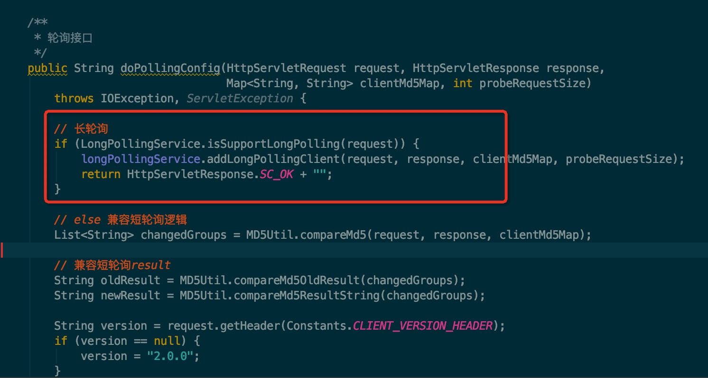

可以看到该方法是一个轮询的接口，除了支持长轮询外还支持短轮询的逻辑，这里我们只关心长轮询的部分，也就是图中红框中的部分。

再次进入 longPollingService 的 addLongPollingClient 方法，如下图所示：

> com.alibaba.nacos.config.server.service.LongPollingService.java

从该方法的名字我们可以知道，该方法主要是将客户端的长轮询请求添加到某个东西中去，在方法的最后一行我们得到了答案：服务端将客户端的长轮询请求封装成一个叫 ClientLongPolling 的任务，交给 scheduler 去执行。

但是请注意我用红框圈出来的代码，服务端拿到客户端提交的超时时间后，又减去了 500ms 也就是说服务端在这里使用了一个比客户端提交的时间少 500ms 的超时时间，也就是 29.5s，看到这个 29.5s 我们应该有点兴奋了。

**PS：这里的 timeout 不一定一直是 29.5，当 isFixedPolling() 方法为 true 时，timeout 将会是一个固定的间隔时间，这里为了描述简单就直接用 29.5 来进行说明。**

接下来我们来看服务端封装的 ClientLongPolling 的任务到底执行的什么操作，如下图所示：

> com.alibaba.nacos.config.server.service.LongPollingService.ClientLongPolling.java

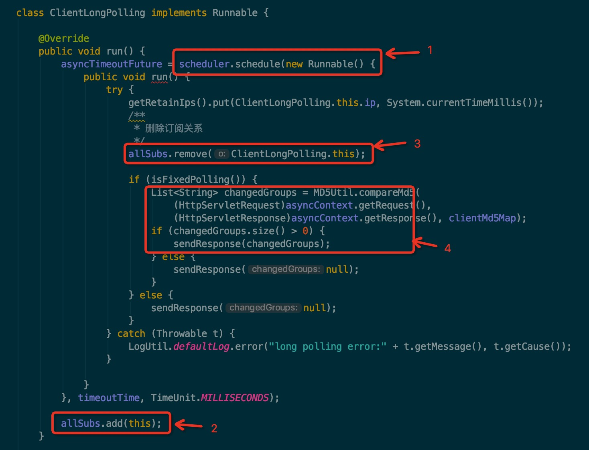

ClientLongPolling 被提交给 scheduler 执行之后，实际执行的内容可以拆分成以下四个步骤：

- 1.创建一个调度的任务，调度的延时时间为 29.5s 
- 2.将该 ClientLongPolling 自身的实例添加到一个 allSubs 中去
- 3.延时时间到了之后，首先将该 ClientLongPolling 自身的实例从 allSubs 中移除
- 4.获取服务端中保存的对应客户端请求的 groupKeys 是否发生变更，将结果写入 response 返回给客户端

整个过程可以用下面的图进行描述：

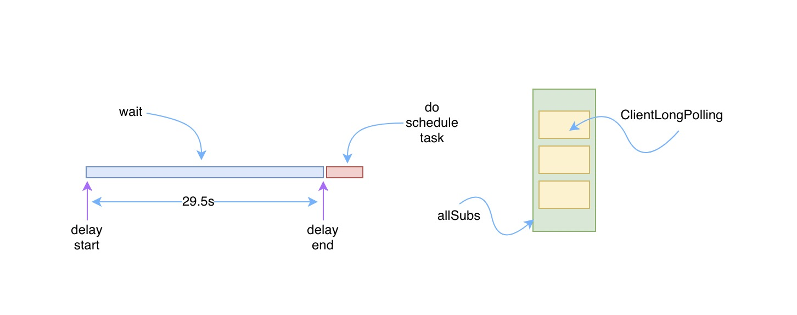

这里出现了一个很关键的 allSubs 对象，该对象是一个 ConcurrentLinkedQueue 队列，ClientLongPolling 将自身添加到队列中去肯定是有原因的，这里需要对 allSubs 留个心眼。

### 调度任务

我们先不管 allSubs 队列具体做了什么事，先来看下服务端过了 29.5s 的延时时间后，执行调度任务时做了什么，也就是上图中对应的第三、第四步。

首先将自身从 allSubs 队列中删除掉，也就是如注释中说的：删除订阅关系，从这里我们可以知道 allSubs 和 ClientLongPolling 之间维持了一种订阅关系，而 ClientLongPolling 是被订阅的。

**PS：删除掉订阅关系之后，订阅方就无法对被订阅方进行通知了。**

然后服务端对客户端提交上来的 groupKey 进行检查，如果发现某一个 groupKey 的 md5 值还不是最新的，则说明客户端的配置项还没发生变更，所以将该 groupKey 放到一个 changedGroupKeys 列表中，最后将该 changedGroupKeys 返回给客户端。

对于客户端来说，只要拿到 changedGroupKeys 即可，后续的操作我在上一篇文章中已经分析过了。

### 服务端数据变更

服务端直到调度任务的延时时间到了之前，ClientLongPolling 都不会有其他的任务可做，所以在这段时间内，该 allSubs 队列肯定有事情需要进行处理。

回想到我们在客户端长轮询期间，更改了配置之后，客户端能够立即得到响应，所以我们有理由相信，这个队列可能会跟配置变更有关系。

现在我们找一下在 dashboard 上修改配置后，调用的请求，可以很容易的找到该请求对应的 url为：/v1/cs/configs 并且是一个 POST 请求，具体的方法是 ConfigController 中的 publishConfig 方法，如下图所示：

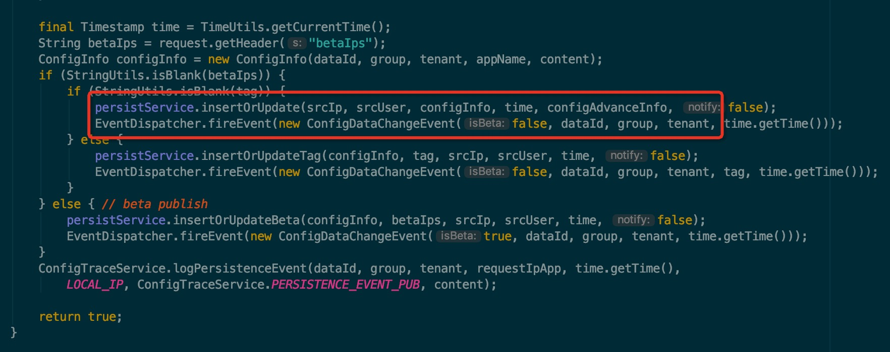

我只截取了重要的部分，从红框中的代码可以看出，修改配置后，服务端首先将配置的值进行了持久化层的更新，然后触发了一个 ConfigDataChangeEvent 的事件。

具体的 fireEvent 的方法如下图所示：

> com.alibaba.nacos.config.server.utils.event.EventDispatcher.java

fireEvent 方法实际上是触发的 AbstractEventListener 的 onEvent 方法，而所有的 listener 是保存在一个叫 listeners 对象中的。

被触发的 AbstractEventListener 对象则是通过 addEventListener 方法添加到 listeners 中的，所以我们只需要找到 addEventListener 方法在何处被调用的，就知道有哪些 AbstractEventListener 需要被触发 onEvent 回调方法了。

可以找到是在 AbstractEventListener 类的构造方法中，将自身注册进去了，如下图所示：

> com.alibaba.nacos.config.server.utils.event.EventDispatcher.AbstractEventListener.java

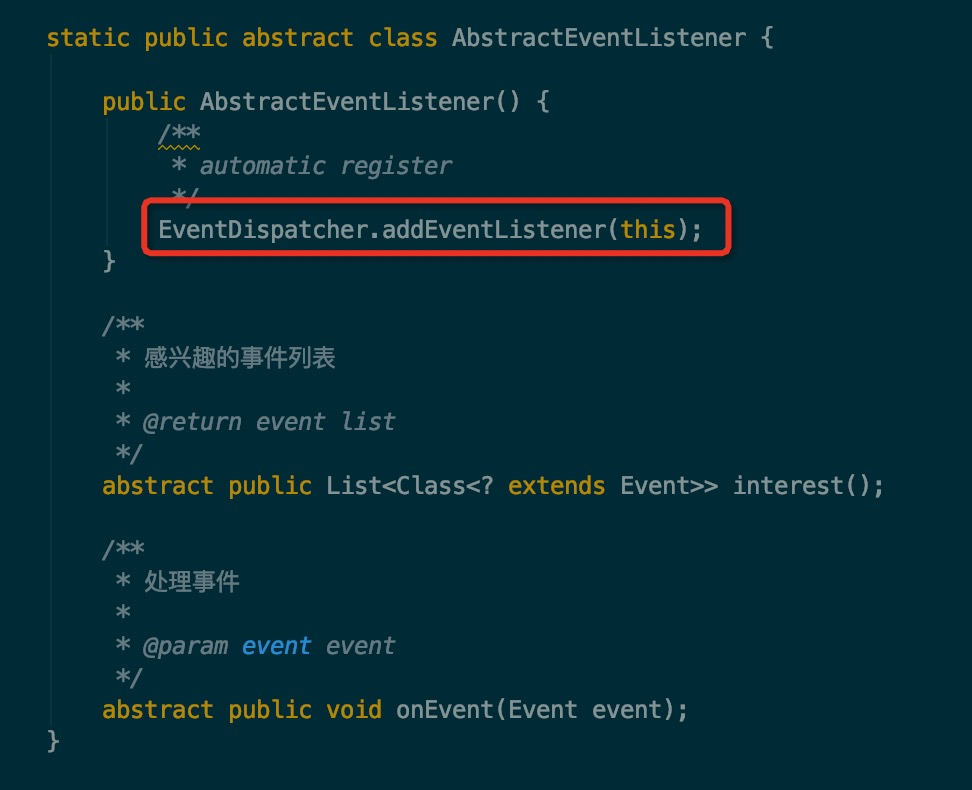

而 AbstractEventListener 是一个抽象类，所以实际注册的应该是 AbstractEventListener 的子类，所以我们需要找到所以继承自 AbstractEventListener 的类，如下图所示：

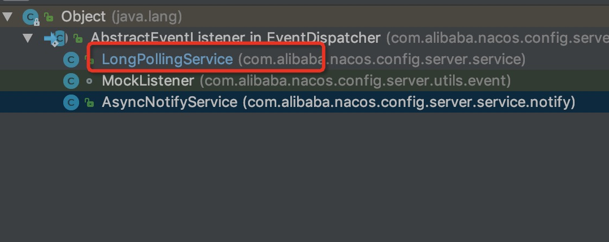

可以看到 AbstractEventListener 所有的子类中，有一个我们熟悉的身影，他就是我们刚刚一直在研究的 LongPollingService。

所以到这里我们就知道了，当我们从 dashboard 中更新了配置项之后，实际会调用到 LongPollingService 的 onEvent 方法。

现在我们继续回到 LongPollingService 中，查看一下 onEvent 方法，如下图所示：

> com.alibaba.nacos.config.server.service.LongPollingService.DataChangeTask.java

发现当触发了 LongPollingService 的 onEvent 方法时，实际是执行了一个叫 DataChangeTask 的任务，应该是通过该任务来通知客户端服务端的数据已经发生了变更，我们进入 DataChangeTask 中看下具体的代码，如下图所示：

代码很简单，可以总结为两个步骤：

- 1.遍历 allSubs 的队列

首先遍历 allSubs 的队列，该队列中维持的是所有客户端的请求任务，需要找到与当前发生变更的配置项的 groupKey 相等的 ClientLongPolling 任务

- 2.往客户端写响应数据

在第一步找到具体的 ClientLongPolling 任务后，只需要将发生变更的 groupKey 通过该 ClientLongPolling 写入到响应对象中，就完成了一次数据变更的 “推送” 操作了

如果 DataChangeTask 任务完成了数据的 “推送” 之后，ClientLongPolling 中的调度任务又开始执行了怎么办呢？

很简单，只要在进行 “推送” 操作之前，先将原来等待执行的调度任务取消掉就可以了，这样就防止了推送操作写完响应数据之后，调度任务又去写响应数据，这时肯定会报错的。

可以从 sendResponse 方法中看到，确实是这样做的：

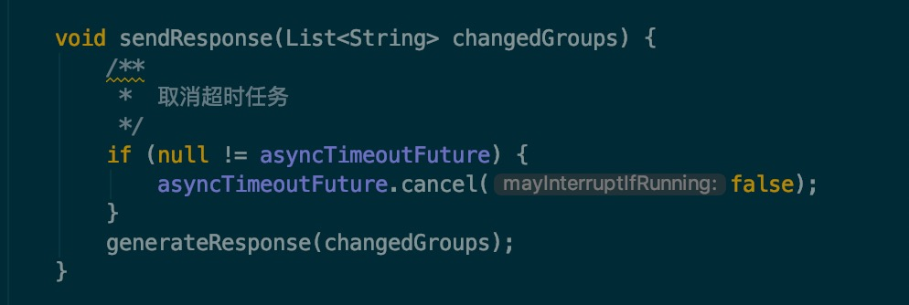

### 问题解答

现在让我们回到刚开始的时候提的几个问题，相信大家已经有了答案了。

- 客户端长轮询的响应时间会受什么影响

客户端长轮询的响应时间，设置的是30s，但是有时响应很快，有时响应很慢，这取决于服务端的配置有没有发生变化。当配置发生变化时，响应很快就会返回，当配置一直没有发生变化时，会等到 29.5s 之后再进行响应。

- 为什么更改了配置信息后客户端会立即得到响应

因为服务端会在更改了配置信息后，找到具体的客户端请求中的 response，然后直接将结果写入 response 中，就像服务端对客户端进行的数据 “推送” 一样，所以客户端会很快得到响应。

- 客户端的超时时间为什么要设置为30s

这应该是一个经验值，该超时时间关系到服务端调度任务的等待时间，服务端在前29.5s 只需要进行等待，最后的 0.5s 才进行配置变更检查。

如果设置的太短，那服务端等待的时间就太短，如果这时配置变更的比较频繁，那很可能无法在**等待期**对客户端做推送，而是滑动到**检查期**对数据进行检查后才能将数据变更发回给客户端，检查期相比等待期需要进行数据的检查，涉及到 IO 操作，而 IO 操作是比较昂贵的，我们应该尽量在**等待期**就将数据变更发送给客户端。

http 请求本来就是无状态的，所以没必要也不能将超时时间设置的太长，这样是对资源的一种浪费。

## 总结

1、客户端的请求到达服务端后，服务端将该请求加入到一个叫 allSubs 的队列中，等待配置发生变更时 DataChangeTask 主动去触发，并将变更后的数据写入响应对象，如下图所示：

2、与此同时服务端也将该请求封装成一个调度任务去执行，等待调度的期间就是等待 DataChangeTask 主动触发的，如果延迟时间到了 DataChangeTask 还未触发的话，则调度任务开始执行数据变更的检查，然后将检查的结果写入响应对象，如下图所示：

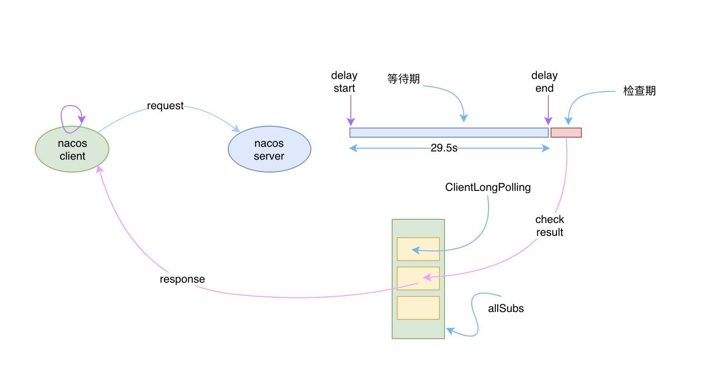

基于上述的分析，最终总结了以下结论：

- 1.Nacos 客户端会循环请求服务端变更的数据，并且超时时间设置为30s，当配置发生变化时，请求的响应会立即返回，否则会一直等到 29.5s+ 之后再返回响应
- 2.Nacos 客户端能够实时感知到服务端配置发生了变化。
- 3.实时感知是建立在客户端拉和服务端“推”的基础上，但是这里的服务端“推”需要打上引号，因为服务端和客户端直接本质上还是通过 http 进行数据通讯的，之所以有“推”的感觉，是因为服务端主动将变更后的数据通过 http 的 response 对象提前写入了。

至此，正如标题所说的，推+拉打造 Nacos 配置信息的实时更新的原理已经分析清楚了。

