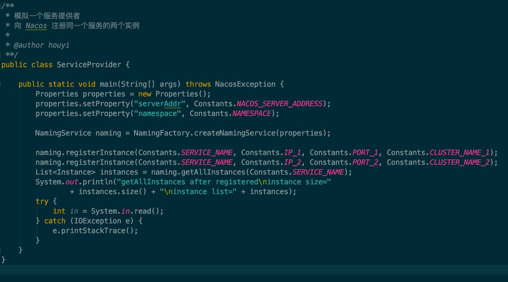
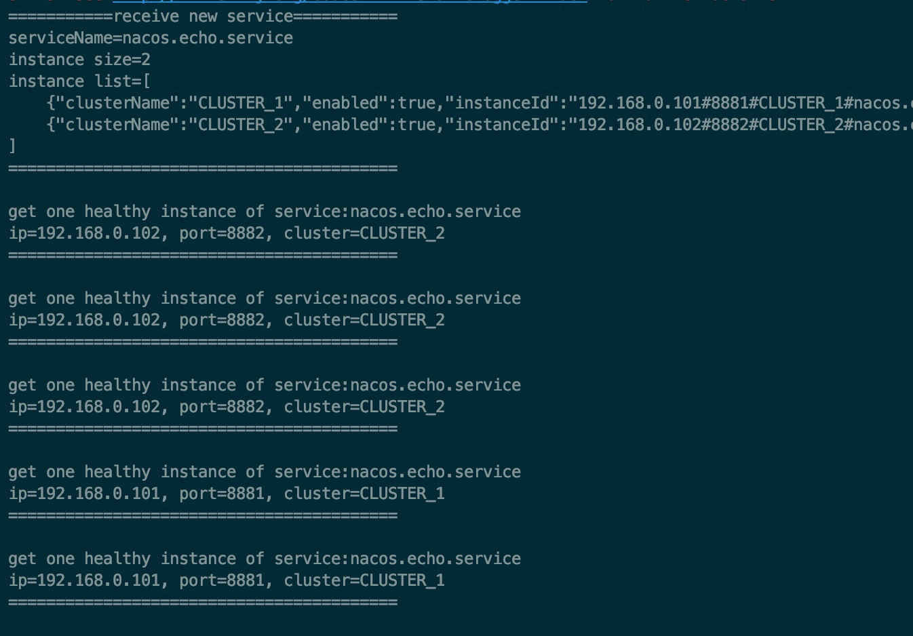

Nacos 另一个非常重要的特性是服务注册与发现，说到服务的注册与发现相信大家应该都不陌生，在微服务盛行的今天，服务是非常重要的，而在 Nacos 中服务更被称为他的一等公民。

Nacos 支持几乎所有主流类型的 “服务” 的发现、配置和管理。

了解过 Dubbo 的同学，应该对 Dubbo 的架构非常熟悉，最经典的一张架构图如下所示：

整个调用关系由几下几个部分组成：

0. 服务容器负责启动，加载，运行服务提供者。
1. 服务提供者在启动时，向注册中心注册自己提供的服务。
2. 服务消费者在启动时，向注册中心订阅自己所需的服务。
3. 注册中心返回服务提供者地址列表给消费者，如果有变更，注册中心将基于长连接推送变更数据给消费者。
4. 服务消费者，从提供者地址列表中，基于软负载均衡算法，选一台提供者进行调用，如果调用失败，再选另一台调用。
5. 服务消费者和提供者，在内存中累计调用次数和调用时间，定时每分钟发送一次统计数据到监控中心。

其中图中最上方的 Registry 就是注册中心，负责服务的注册与发现。Dubbo 有自己的 Registry 实现，而 Nacos 则是另一种 Registry 的实现。

现在我们来了解下 Nacos 的服务注册与发现，首先在本地将 Nacos 服务端启动起来，具体怎么操作这里不在赘述，不清楚的同学可以参考我的其他文章。

## 服务注册

我们模拟将同一个服务的两个实例注册到 Nacos 中，代码如下图所示：

通过 NamingService 接口的 registerInstance 方法就可以将服务进行注册了，该方法有很多重载的方法，这里我们选择一个简单的来调用就好了。

注册完成后，通过调用 getAllInstances 方法，立即获取所有可用的实例，然后让主线程等待，打印如下：

从打印结果中可以发现 naming 客户端成功获取到了两个实例。

## 服务发现

服务注册之后，服务的消费者就可以向注册中心订阅自己所需要的服务了，注册中心会将所有服务的实例“推送”给消费者，这里我在推送上打了引号，原因是实际上获取服务是客户端主动轮询的，跟客户端获取配置中心的配置项的原理一样。这里不进行具体的描述，有兴趣的可以跟一下代码就知道了。

现在我创建一个服务消费者，然后向注册中心订阅一个服务，当接收到注册中心返回的服务列表之后，执行5次 select 服务实例的操作，相当于进行一个模拟的服务请求，具体的代码如下图所示：

其中的 printInstances 方法主要是打印出所有服务的实例，为了节省篇幅就不写出来了，将 ServiceConsumer 类启动之后，打印出如下的日志：

消费者每次获取一个健康的实例进行调用，接下来我就来分析下整个服务注册与发现的过程和大致的设计原理和思路。

我不打算从源码中一步一步的寻找答案，而是直接将结论揭示出来，试着将整个事情通俗易懂的讲解清楚。

## 完整过程与原理

服务注册到哪里

服务怎么发现

负载均衡

服务提供者一共注册了两个服务的实例，消费者一次性请求了五次获取服务实例的方法，

官方提供的demo具有一定的迷惑性，不过这能迫使你去了解事物的本质。

